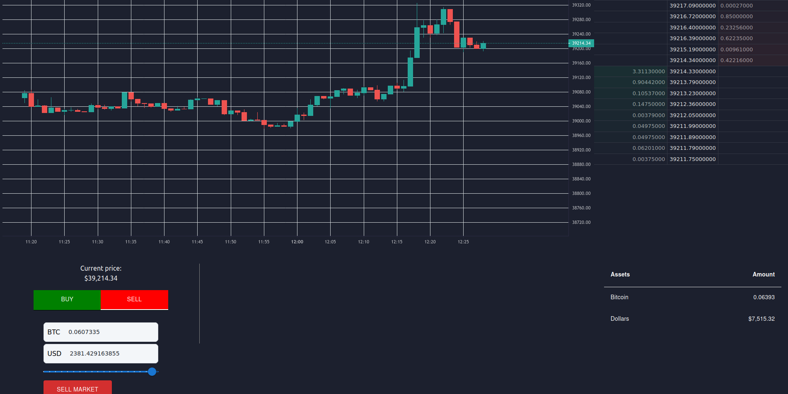

# Polytrade



# Prerequisites

- npm
- sbt
- docker

# Usage
To run polytrade locally you can use docker compose or run the following commands:
```bash
# start mongo database
docker run -p 27017:27017 -d -v mongodbdata:/data/db mongo

#Go to backend folder and run
sbt run

#In another terminal go to front folder and run
npm run dev
``` 

Now you can go to http://localhost:3000/ and use the polytrade webapp.
